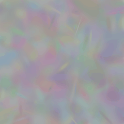

Fit a Single Image
===================================

.. currentmodule:: gsplat

The :code:`examples/image_fitting.py` script allows you to test the basic rasterization process
on a set of random gaussians and their differentiability on a single training image. 

Simply run the script under `examples/`:

.. code-block:: bash

    python image_fitting.py --height 256 --width 256 --num_points 2000 --save_imgs

to get a result similar to the one below:

You can also provide a path to your own custom image file using the ``--img_path`` flag:

.. code-block:: bash

    python image_fitting.py --img_path PATH_TO_IMG --save_imgs
