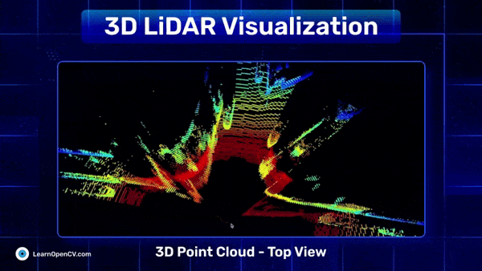

# 3D LiDAR Visualization using Open3D: A Case Study on 2D KITTI Depth Frames for Autonomous Driving

This repository contains the Jupyter Notebook for generating and visualizing 3D point cloud representations of the 2D KITTI Depth Frames dataset. This is part of the LearnOpenCV blog post - [3D LiDAR Visualization using Open3D: A Case Study on 2D KITTI Depth Frames for Autonomous Driving](https://learnopencv.com/3d-lidar-visualization/).

The notebook is one-click runnable and the dataset will download automatically.

## AI Courses by OpenCV

Want to become an expert in AI? [AI Courses by OpenCV](https://opencv.org/courses/) is a great place to start.

