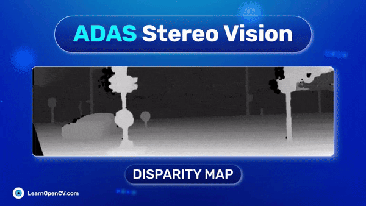

# Stereo Vision for ADAS: Pioneering Depth Perception Beyond LiDAR

This repository contains code for fine-tuning the STereo TRansformer (STTR) and also perform inference on it. This is part of the LearnOpenCV blog post - [Stereo Vision for ADAS: Pioneering Depth Perception Beyond LIDAR](https://learnopencv.com/adas-stereo-vision/).

The notebook for inference is within the `scripts` directory named as `inference-kitti.ipynb`.

## AI Courses by OpenCV

Want to become an expert in AI? [AI Courses by OpenCV](https://opencv.org/courses/) is a great place to start.

