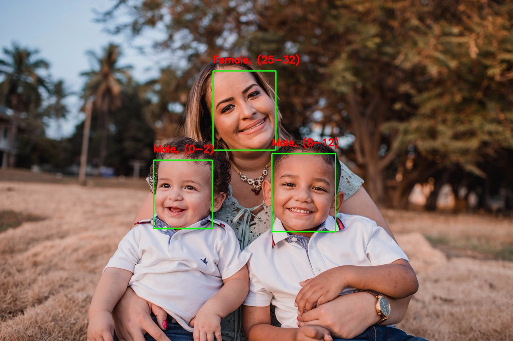

## Code for Age Gender recognition using Deep Learning

### Models
Download models from

Gender Net : https://www.dropbox.com/s/iyv483wz7ztr9gh/gender_net.caffemodel?dl=0"

Age Net : https://www.dropbox.com/s/xfb20y596869vbb/age_net.caffemodel?dl=0"

### Run Code

#### C++
```
cmake .
make
./AgeGender <input_file>(Leave blank for webcam)
```

#### Python
```
python AgeGender.py --input <input_file>(Leave blank for webcam)
```

### Sample Result


