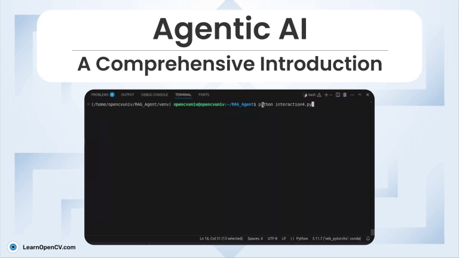

# Agentic-AI

This repository contains two folders, DIrectionX and SmartRetriever to setup the Agentic AI workflow on your local machine. 

Each of them contains various python scripts to execute the implementation of AI Agents using both paid (OpenAI) and free-to-use (Google Gemini) models. 

It is part of the LearnOpenCV blog post - [Agentic-AI-A-Comprehensive-Introduction](https://learnopencv.com/agentic-ai/).

## AI Courses by OpenCV

Want to become an expert in AI? [AI Courses by OpenCV](https://opencv.org/courses/) is a great place to start.

