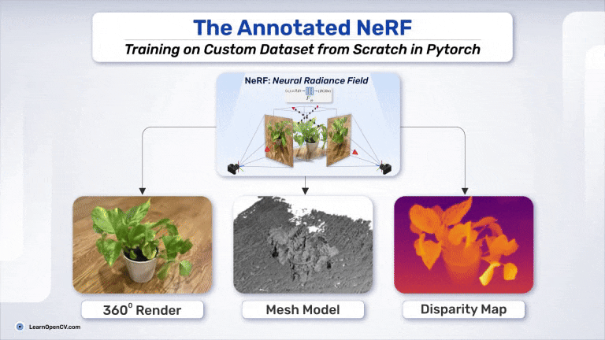

# The Annotated NeRF: Training on Custom Dataset from Scratch in Pytorch

This folder contains the Jupyter Notebooks and scripts for the LearnOpenCV article  - **[The Annotated NeRF: Training on Custom Dataset from Scratch in Pytorch](https://learnopencv.com/fine-tune-dino-self-supervised-learning-segmentation/)**.

