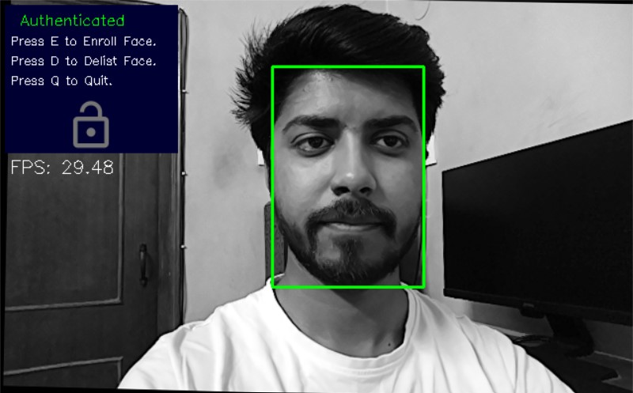
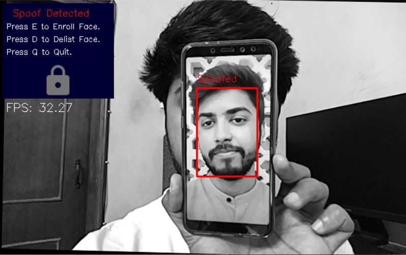

# Anti-Spoofing Face Recognition System using OAK-D and DepthAI

**This repository contains code for [Anti-Spoofing Face Recognition System using OAK-D and DepthAI](https://learnopencv.com/anti-spoofing-face-recognition-system-using-oak-d-and-depthai/) blogpost**.


[](https://www.dropbox.com/sh/4xl3tvo7vuu6lz2/AACCG_AOfTggykhFQAiWbPPWa?dl=1)

## Install requirements
```
pip install -r requirements.txt
```

## Run Script after connecting the OAK-D device
```
python facenet_face_authentication_anti_spoof.py
```

## Sample Output




# AI Courses by OpenCV

Want to become an expert in AI? [AI Courses by OpenCV](https://opencv.org/courses/) is a great place to start. 

<a href="https://opencv.org/courses/">
<p align="center"> 

</p>
</a>
