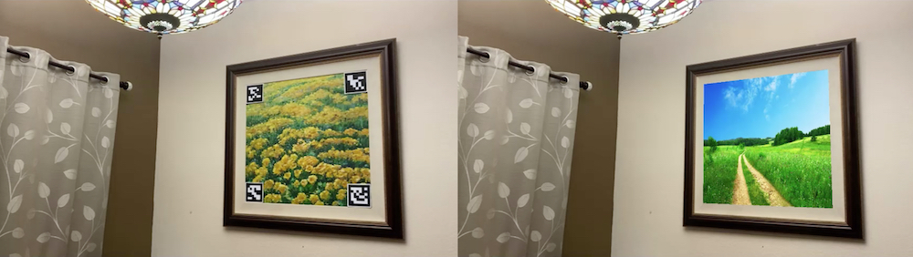

### Augmented Reality using AruCo Markers in OpenCV

We show how to use the AruCo markers in OpenCV using an augmented reality application to replace the image inside a picture frame on a wall to display new images or videos in the frame.

### Compilation in C++

```
g++ -std=c++11 augmented_reality_with_aruco.cpp -o augmented_reality_with_aruco.out `pkg-config --cflags --libs opencv4`
```

### How to run the code

Command line usage for running the code

* Python

  * A single image:
    	
    ```
    python3 augmented_reality_with_aruco.py --image=test.jpg
    ```
    
  * A video file:

    ```
    python3 augmented_reality_with_aruco.py --video=test.mp4
    ```       

* C++:

  * A single image:
        
    ```
    ./augmented_reality_with_aruco.out --image=test.jpg
    ```

  * A video file:

    ```
     ./augmented_reality_with_aruco.out --video=test.mp4
    ```

### Results of YOLOv3

