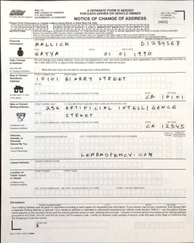

# Code for Automatic Document Alignment
### -By Aneerban Chakraborty

This blogpost will follow the following steps:
* Morphology
* GrabCut
* Canny Edge Detection
* Contours
* Corner Detection using Douglas-Peucker algorithm
* Homography & Perspective Transform
* Crop Result

You will learn to perform document alignment using the above techniques. This also imcludes a Streamlit Web-Application.

### Input

### Output:

