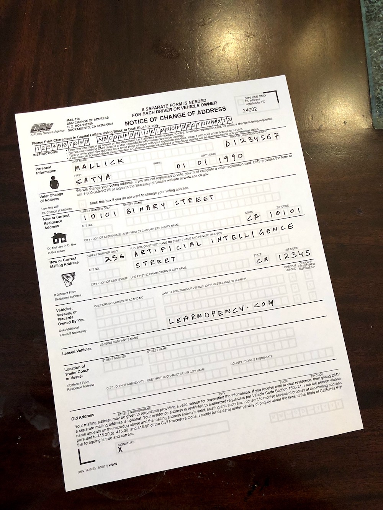
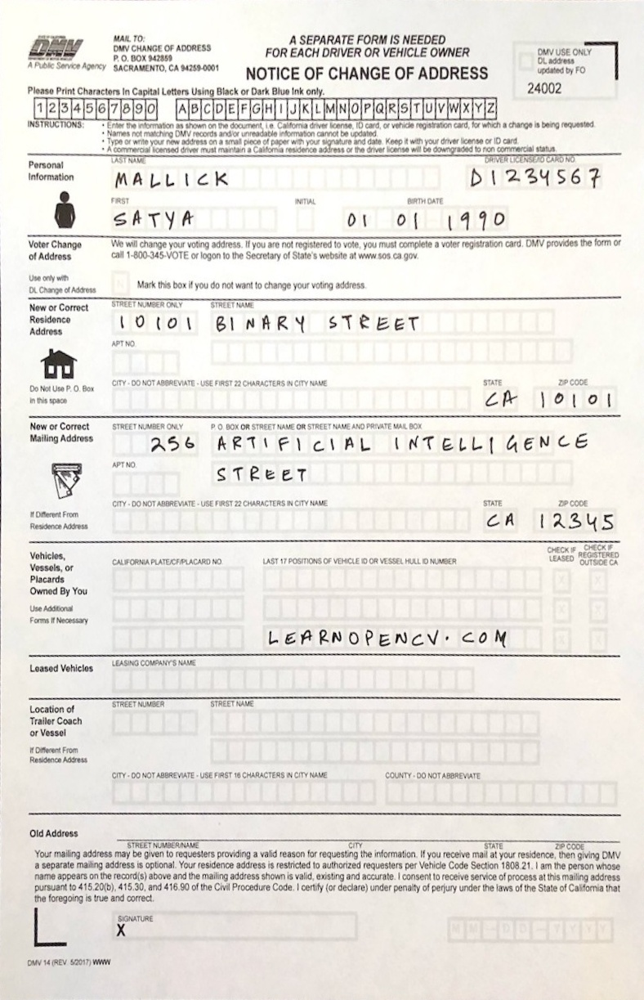

# Automatic Document Scanner using OpenCV

**This repository contains code for [Automatic Document Scanner using OpenCV](https://learnopencv.com/automatic-document-scanner-using-opencv/) blog post**.

[](https://www.dropbox.com/sh/i338audbv9yaptp/AABKAptWYRt8UMFZRz-QXrFPa?dl=1)

In this post, you will learn the following,

* Morphology
* Canny Edge Detection
* Contours
* Corner Detection using Douglas-Peucker algorithm
* Homography
* Perspective Transform

## Install requirements
```
pip install -r requirements.txt
```

### Input



### Output:



# AI Courses by OpenCV

Want to become an expert in AI? [AI Courses by OpenCV](https://opencv.org/courses/) is a great place to start. 

<a href="https://opencv.org/courses/">
<p align="center"> 

</p>
</a>
