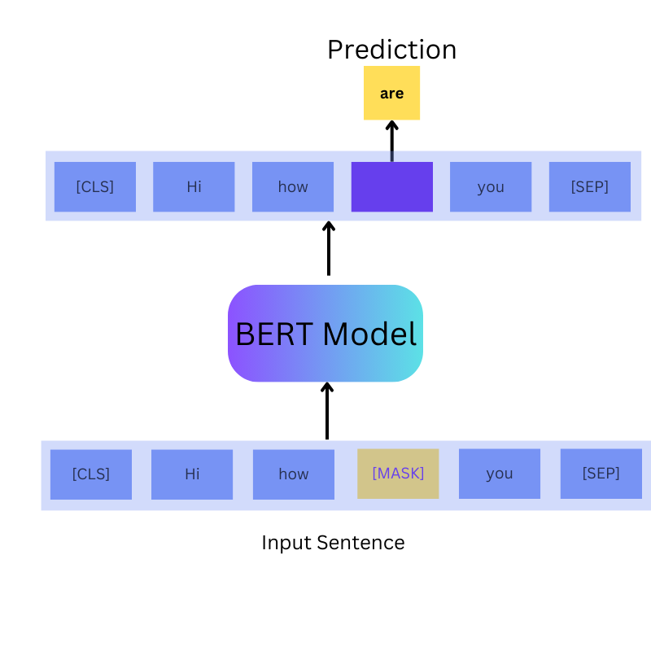

# BERT: Bidirectional Encoder Representations from Transformers

**This folder contains code for [BERT: Bidirectional Encoder Representations from Transformers](https://learnopencv.com/bert-bidirectional-encoder-representations-from-transformers/) - Unlocking the Power of Deep Contextualized Word Embeddings blogpost**.

Download the Jupyter notebooks and the trained model using the following link.

# [AI Courses by OpenCV](https://github.com/spmallick/learnopencv/tree/master/Comparing-KerasCV-YOLOv8-Models-on-the-Global-Wheat-Data-2020#ai-courses-by-opencv)

Want to become an expert in AI? [AI Courses by OpenCV](https://opencv.org/courses/) is a great place to start.

