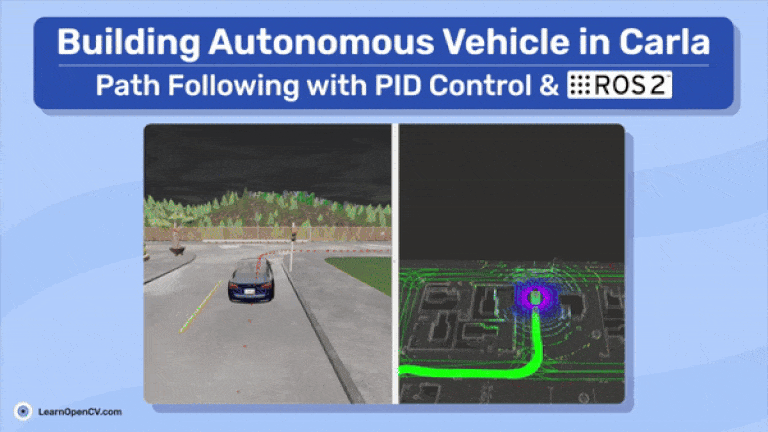

# Building Autonomous Vehicle in Carla: Path Following with PID Control & ROS 2


This folder contains the Jupyter Notebooks and and images for the LearnOpenCV article  - **[Building Autonomous Vehicle in Carla: Path Following with PID Control and ROS 2](https://learnopencv.com/pid-controller-ros-2-carla/)**.

You can download the custom code directory and images from the below link. After downloading, follow the steps in the article to clone and set up the official repository and then copy the `custom_code` folder into the cloned git directory.

[](https://www.dropbox.com/scl/fo/kg4acpbysdwtpug1tuqjl/AA5FTUTTLsRHl4Q_ha9Ga5s?rlkey=4s8wnizvf7oe5qvypett0tu93&st=vie1e8fx&dl=1)



## AI Courses by OpenCV

Want to become an expert in AI? [AI Courses by OpenCV](https://opencv.org/courses/) is a great place to start.

[](https://opencv.org/courses/)

## How to Run:

```bash
# in a new terminal, run carla first
# $ ./CarlaUE4.sh  # or ./CarlaUE4.sh -prefernvidia # $ ~/carla_simulator/PythonAPI/util/config.py --map Town01
$CARLA_ROOT/CarlaUE4.sh -quality-level=Low -prefernvidia -nosound

# in a new terminal, get inside the `carla-ros-bridge/colcon_ws` folder and source the workspace; launch the `carla ros-bridge`
cd ~/carla-ros-bridge/colcon_ws && source install/setup.bash 
ros2 launch carla_ros_bridge carla_ros_bridge.launch.py synchronous_mode:=True town:=Town01 # <town number, eg: 03>


# in a new terminal, launch the objects.json; launch ros-bridge
# cd ~/carla-ros-bridge/colcon_ws
cd ~/carla-ros-bridge/colcon_ws && source install/setup.bash 

ros2 launch carla_spawn_objects carla_example_ego_vehicle.launch.py spawn_sensors_only:=False objects_definition_file:=<absolute path to>/src/vehicle_ctrl/vehicle_ctrl/config/objects.json


# load the town1 lanelet map
python src/vehicle_ctrl/vehicle_ctrl/map.py


# in new terminal, launch the rviz2 [set the global frame to map in rviz2]
rviz2 -d /src/vehicle_ctrl/rviz2/carla_map_spawn_anywherev2.rviz


# in a new terminal, get inside the `carla-ros-bridge/colcon_ws` folder and source the workspace; waypoint publisher 
cd ~/carla-ros-bridge/colcon_ws && source install/setup.bash 
ros2 launch carla_waypoint_publisher carla_waypoint_publisher.launch.py


# goal remap
python src/vehicle_ctrl/vehicle_ctrl/remap_goal.py 


# waypoint following using carls ros-bridge
python src/vehicle_ctrl/vehicle_ctrl/simple_ctrl.py
```

The `.py` files are a part of `vehicle_ctrl` package under the `Building_Autonomous_Vehicle_in_Carla_Path_Following_with_PID_Control_ROS2` folder, so if faced any issue build the workspace using below commands,

```bash
$ colcon build
$ source install/setup.bash
```