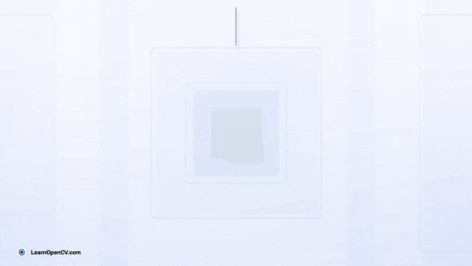

# CVPR 2024: An Overview and Key Papers

This repository contains the Notebook file and Python scripts to run the Inference.   

It is part of the LearnOpenCV blog post - [CVPR 2024: An Overview and Key Papers](https://learnopencv.com/cvpr2024/)

### Code and Requirements

Run the ``.ipynb`` files in your python environment.

Install the ``requirements.txt`` file if you want to run any of the research paper ``.py`` code.

For ZeroNVS install the ``requirements-zeronvs.txt`` file.

## AI Courses by OpenCV

Want to become an expert in AI? [AI Courses by OpenCV](https://opencv.org/courses/) is a great place to start.

