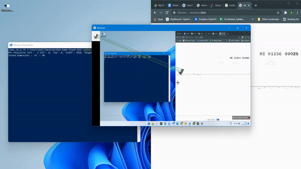
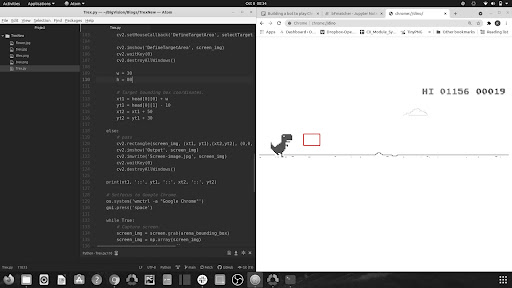

# T-Rex Game Bot using Feature Matching in OpenCV

A bot to automate Chrome Dino game using Feature Matching, AutoPyGUI and MSS.

### Install required packages

```
pip install -r requirements.txt
```
### Execution Guideline
 - Position chrome window to the right half of the screen.
 - Open terminal/powershell on the left half as shown below.
 - Navigate to the working directory and run the script.

<p align="center">


The obstacle detection area should look something like the image shown below. If not,
play with the box height percentage and check if display auto scaling is ON. Further
instruction has been provided within the code.

<br>

<p align="center">


# AI Courses by OpenCV

Want to become an expert in AI? [AI Courses by OpenCV](https://opencv.org/courses/) is a great place to start. 

<a href="https://opencv.org/courses/">
<p align="center"> 

</p>
</a>