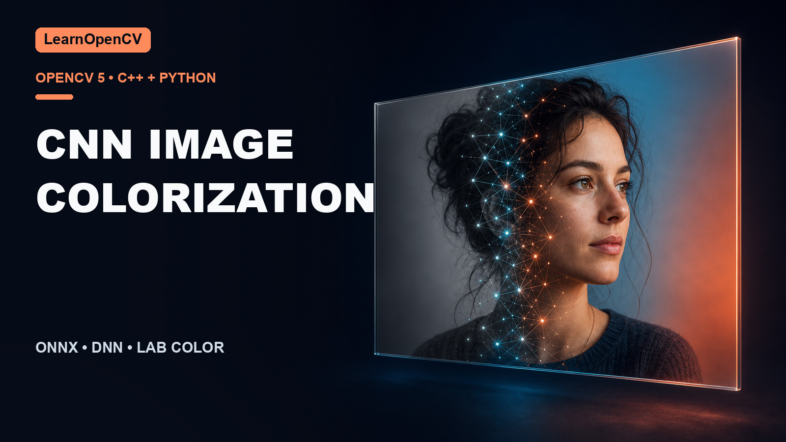

# CNN-Based Image Colorization with OpenCV DNN

[](https://learnopencv.com/convolutional-neural-network-based-image-colorization-using-opencv/)

This folder accompanies
[CNN-Based Image Colorization with OpenCV](https://learnopencv.com/convolutional-neural-network-based-image-colorization-using-opencv/).
The refreshed C++ and Python implementations use one verified ONNX export of
the original ECCV 2016 model.

OpenCV 5 removed the legacy Caffe model parser. ONNX keeps the tutorial usable
with OpenCV 4.14 and OpenCV 5 without runtime layer surgery or
`pts_in_hull.npy`.

## Compatibility

| Path | Requirements |
|---|---|
| Python | Python 3.10+, OpenCV 4.14.0 or 5.0.0 |
| C++ | CMake 3.16+, C++17, OpenCV 4.14.0 or 5.0.0 |

## Model setup

```bash
chmod +x getModels.sh
./getModels.sh
```

The script downloads `models/colorization_eccv16.onnx` from the versioned
release, verifies SHA-256
`a1680679b609ca4d107edb83b8ac89c283cc474ce0a81edd6f01db85910e8201`,
and only then installs it. See [ASSET_ATTRIBUTION.md](ASSET_ATTRIBUTION.md) for
model provenance and the retained legacy Caffe files.

To reproduce the release asset from an upstream checkout:

```bash
python -m pip install -r requirements-export.txt
python export_onnx.py \
  --upstream-dir /path/to/richzhang-colorization \
  --output models/colorization_eccv16.onnx
```

The export requirements are pinned because ONNX serialization can change
between exporter versions even when model predictions are numerically
equivalent.

## Python

```bash
python3 -m venv .venv
source .venv/bin/activate
python -m pip install -r requirements.txt

python colorizeImage.py --no-display --validate
python colorizeVideo.py --max-frames 2 --no-display --validate
```

Use `--input`, `--model`, and `--output` to override the bundled samples and
defaults.

## C++

```bash
cmake -S . -B build -DCMAKE_BUILD_TYPE=Release
cmake --build build --parallel

./build/colorize_image --no-display --validate
./build/colorize_video --max-frames 2 --no-display --validate
```

## Color pipeline

1. Convert BGR input to CIE Lab and preserve the original-resolution L channel.
2. Resize L to 256×256 and run the ONNX model through OpenCV DNN on CPU.
3. Resize the predicted `a,b` chroma channels to the original dimensions.
4. Merge `L,a,b`, convert back to BGR, clip, and save.

`--validate` checks the output dimensions, data type, and that the predicted
chroma is finite and nontrivial.

```bash
python -m pytest -q tests
ctest --test-dir build --output-on-failure
```

## Versioned download

The `colorization-opencv-2026.07.25` GitHub Release contains the tested project
archive, ONNX model, and `SHA256SUMS.txt` checksum manifest.


---

<p align="center">
  <a href="https://bigvision.ai/">
    
  </a>
</p>

<h2 align="center">Build Production-Ready Computer Vision &amp; AI Solutions</h2>

<p align="center">
  LearnOpenCV is maintained by <a href="https://bigvision.ai/"><strong>BigVision.AI</strong></a>, a computer vision and AI consulting company. We help organizations design, build, optimize, and deploy production-ready AI solutions. Our team has deep expertise in computer vision, deep learning, multimodal AI, and edge deployment, with experience solving complex technical challenges across industries.
</p>

<p align="center">
  Have a project in mind? Talk with our expert AI solution builders.
</p>

<p align="center">
  <a href="https://bigvision.ai/expert-ai-solution-builders?utm_source=locv-github">
    
  </a>
</p>
