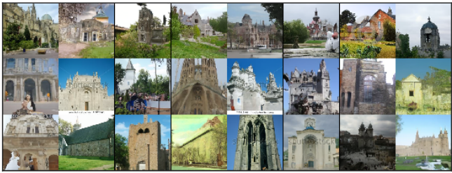

# DDIM-The-Faster-Improved-Version-of-DDPM-for-Efficient-AI-Image-Generation

This repository contains the script to perform inferencing on Stable Diffusion using DDIM Scheduler. This is a part of the LearnOpenCV blog post - [DDIM: The Faster, Improved Version of DDPM for Efficient AI Image Generation](https://learnopencv.com/understanding-ddim/).

## AI Courses by OpenCV

Want to become an expert in AI? [AI Courses by OpenCV](https://opencv.org/courses/) is a great place to start.

