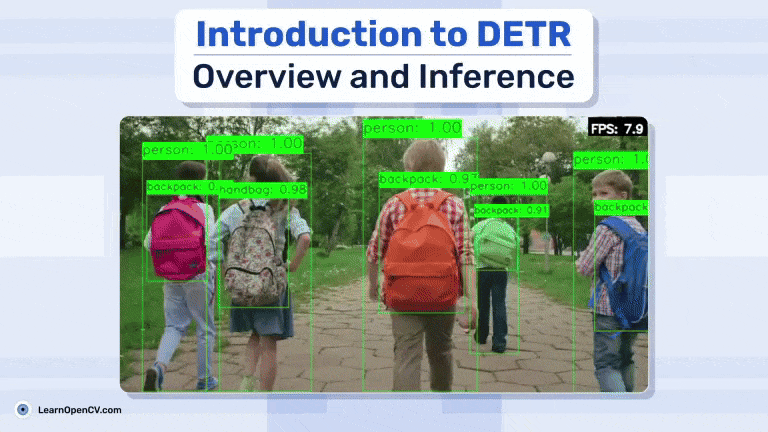

# DETR: Overview and Inference

This repository contains the Python notebook to run the Inference for DETR

It is part of the LearnOpenCV blog post - [DETR: Overiew and Inference](https://learnopencv.com/).

### Run Inference

Use the ``DETR_INFERENCE.ipynb`` file to run the inference.

## AI Courses by OpenCV

Want to become an expert in AI? [AI Courses by OpenCV](https://opencv.org/courses/) is a great place to start.

