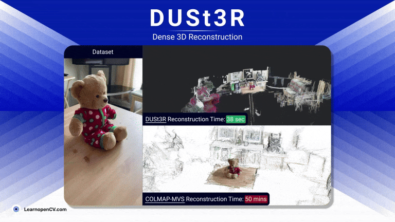

# DUSt3R: Geometric 3D Vision Made Easy :  Explanation and Results

This folder contains the Jupyter Notebooks and Scripts for the LearnOpenCV article  - **[DUSt3R: Dense and Unconstrained Stereo 3D Reconstruction](https://learnopencv.com/dust3r-geometric-3d-vision/)**.



### subsetsTo run:

Visit DUSt3R Repository : [Link](https://github.com/naver/dust3r)

```python
git clone --recursive https://github.com/naver/dust3r
cd dust3r
# if you have already cloned dust3r:
# git submodule update --init --recursive
```

```python
#setup
!pip install -r requirements.txt
# Optional: you can also install additional packages to:
# - add support for HEIC images
# - add pyrender, used to render depthmap in some datasets preprocessing
# - add required packages for visloc.py
!pip install -r requirements_optional.txt
```

**Download checkpoints**:
`mkdir -p checkpoints/
!wget https://download.europe.naverlabs.com/ComputerVision/DUSt3R/DUSt3R_ViTLarge_BaseDecoder_512_dpt.pth -P checkpoints/`

**Gradio Demo**

The input can be a single image or multiple images, and if you have limited GPU Resources say 6GB or 12 GB, for larger scenes go with `one-ref` pairing strategy. Otherwise use complete-pairing strategy for small subsets.

---

**Datasets used in Article**:

1. [Tanks and Temples](https://www.tanksandtemples.org/download/) - Family | Church    >>> Image Set
2. [CO3D](https://ai.meta.com/datasets/co3d-downloads/)   - motorcycle | teddybear
3. DSLR Camera: [ Download Link ](https://www.dropbox.com/scl/fi/ijhlr5n5gevf14ujijc2k/images_fps2.zip?rlkey=ruqy7op8olvfab6lrbodk5kxs&st=77qz1fsl&dl=1)

Download individual **Point Cloud Outputs of DUSt3R** if you are limited with internet pack:

1. [Teddy Subset](https://www.dropbox.com/scl/fi/l5r30n1u27vrp3n6wzugi/teddy-subset.zip?rlkey=9op2akguwhrxzzttxnqc3m58c&st=i2w3joku&dl=1)  - [DUSt3R GLB](https://www.dropbox.com/scl/fi/q9ku7qpn2po82hrimt8lw/teddy-bear-subset-scene.glb?rlkey=j922q81e5exvkdnoh86f2ix1q&st=r4xh77u2&dl=1) - oneref
2. [DSLR  Scene](https://www.dropbox.com/scl/fi/bitwddlms7jyc92t3nv8b/dslr-images_seqzip?rlkey=wbl8oczv805onvhfr9bhfj2ud&st=yg0vtfuq&dl=1)  -  [DUst3R GLB](https://www.dropbox.com/scl/fi/jwy5msargjvl83ww0em0o/dslr-dust3r-oneref-56secs-scene.glb?rlkey=ypy9t6b44hvjl4375ao7lmyum&st=uelozcry&dl=1) - oneref
3. [Church Subset](https://www.dropbox.com/scl/fi/t2pgpiquz7cj2849lne3i/church_subset50.zip?rlkey=3l4zx2iy3bhjvhhei29n0g905&st=9sj03o08&dl=1) - [DUSt3R GLB](https://www.dropbox.com/scl/fi/0eeho8bvahyt95zt4v6n1/60_church_scene.glb?rlkey=iw1j5qyhhnh1z4u8aj0c409gy&st=z30y2x0k&dl=1) - oneref
4. Bike - [DUSt3R GLB](https://www.dropbox.com/scl/fi/p0nno849nq0x8vkz3q1qr/bike-scene-one-ref.glb?rlkey=7dsryc6emdgg1pia82yu0bse6&st=katc6aey&dl=1) - oneref

**To download all the dataset scenes and point cloud in one go hit the below button**:

[](https://www.dropbox.com/scl/fo/g10q3eluz9oml0m25lkm2/AFOjV2MYpojE23PrmAsbrnI?rlkey=utawyr5orizmxain6r7huoz4v&st=fkitahbr&dl=1)

---

## AI Courses by OpenCV

Want to become an expert in AI? [AI Courses by OpenCV](https://opencv.org/courses/) is a great place to start.

[](https://opencv.org/courses/)