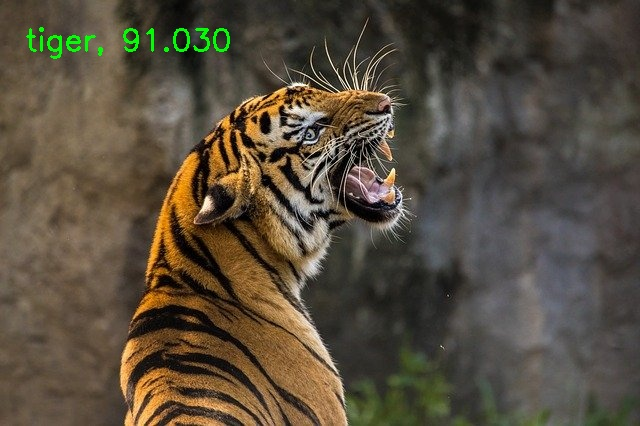
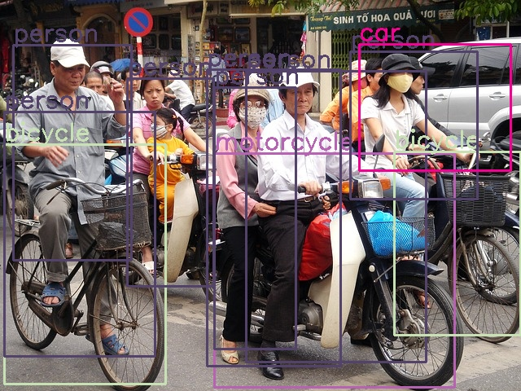

# Deep Learning with OpenCV's DNN Module


## Directory Structure

**All the code files and folders follow the following structure.**

```
├── cpp
│   ├── classify
│   │   ├── classify.cpp
│   │   └── CMakeLists.txt
│   └── detection
│       ├── detect_img
│       │   ├── CMakeLists.txt
│       │   └── detect_img.cpp
│       └── detect_vid
│           ├── CMakeLists.txt
│           └── detect_vid.cpp
├── input
│   ├── classification_classes_ILSVRC2012.txt
│   ├── DenseNet_121.caffemodel
│   ├── DenseNet_121.prototxt
│   ├── frozen_inference_graph.pb
│   ├── image_1.jpg
│   ├── image_2.jpg
│   ├── object_detection_classes_coco.txt
│   ├── ssd_mobilenet_v2_coco_2018_03_29.pbtxt.txt
│   └── video_1.mp4
├── outputs
│   ├── image_result.jpg
│   ├── result_image.jpg
│   └── video_result.mp4
├── python
│   ├── classification
│   │   ├── classify.py
│   │   └── README.md
│   ├── detection
│   │   ├── detect_img.py
│   │   └── detect_vid.py
│   └── requirements.txt
└── README.md
```


## Instructions

### Python

To run the code in Python, please go into the `python` folder and execute the Python scripts in each of the respective sub-folders.

### C++

To run the code in C++, please go into the `cpp` folder, then go into each of the respective sub-folders and follow the steps below:

```
mkdir build
cd build
cmake ..
cmake --build . --config Release
cd ..
./build/classify
```

```
mkdir build
cd build
cmake ..
cmake --build . --config Release
cd ..
./build/detect_img
```

```
mkdir build
cd build
cmake ..
cmake --build . --config Release
cd ..
./build/detect_vid
```


## Outputs

### Image Classification

* 

### Object Detection

* 

  

# AI Courses by OpenCV

Want to become an expert in AI? [AI Courses by OpenCV](https://opencv.org/courses/) is a great place to start.

[](https://opencv.org/courses/)