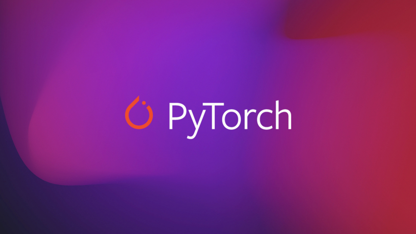

# Distributed Parallel Training: PyTorch Multi-GPU Setup in Kaggle T4x2

**This repository contains scripts for [Distributed Parallel Training: PyTorch](https://learnopencv.com/distributed-parallel-training-pytorch-multi-gpu-setup/) blogpost** 

## AI Courses by OpenCV

Want to become an expert in AI? [AI Courses by OpenCV](https://opencv.org/courses/) is a great place to start.

