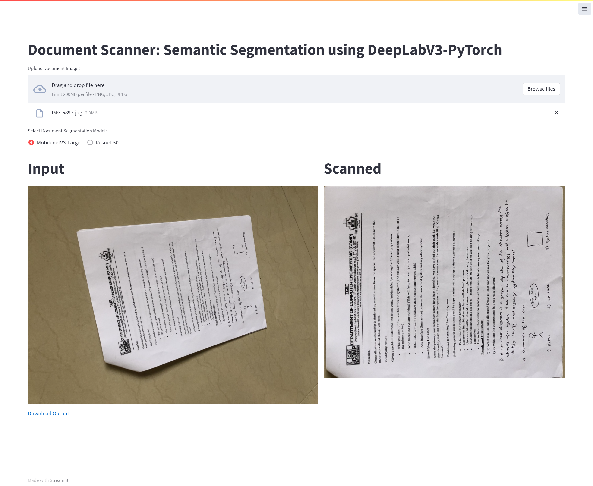

# Document Scanner: Semantic Segmentation using PyTorch-DeepLabV3

**This repository contains code for the blog post [Document Scanner: Semantic Segmentation using PyTorch-DeepLabV3](https://learnopencv.com/custom-document-segmentation-using-deep-learning/)**.

In this post, you will learn the following,

* Generate Synthetic Dataset.
* Create a Combo loss function training a Custom Image Segmentation Model.
* Train a Document Segmentation model using DeepLabv3-PyTorch.

#### Dataset and Trained Model Download Links

1. Resized final dataset: [drive](https://drive.google.com/file/d/1rRmNRQgSW3k09B76AAi5LfGztRSDOXVf/view?usp=sharing)
2. Model - MobileNetV3-Large backend: [drive](https://drive.google.com/file/d/1ROtCvke02aFT6wnK-DTAIKP5-8ppXE2a/view?usp=sharing)
3. Model - Resnet50 backend: [drive](https://drive.google.com/file/d/1DEl6qLckFChSDlT_oLUbO2JpN776Qx-g/view?usp=sharing)

### Document Scanner Application

# AI Courses by OpenCV

Want to become an expert in AI? [AI Courses by OpenCV](https://opencv.org/courses/) is a great place to start.

<a href="https://opencv.org/courses/">

</a>
