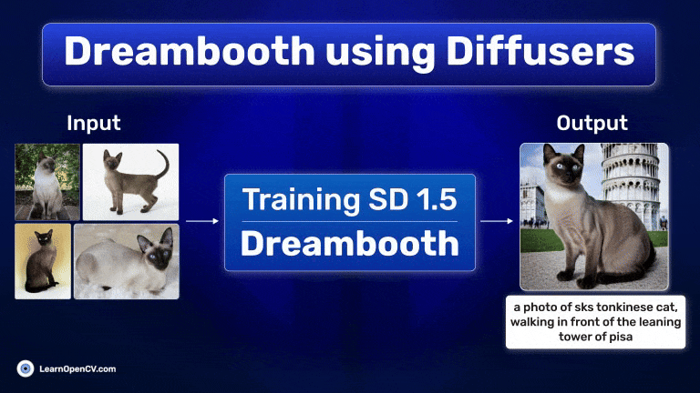

# Dreambooth using Diffusers

This folder contains the notebook and images for the **[Dreambooth using Diffusers](https://learnopencv.com/dreambooth-using-diffusers)** article on LearnOpenCV.

The notebook is end to end executable and it will download the dataset automatically before training.

## AI Courses by OpenCV

Want to become an expert in AI? [AI Courses by OpenCV](https://opencv.org/courses/) is a great place to start.

