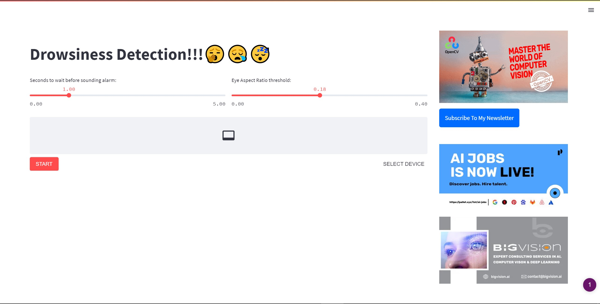

# Driver Drowsines Detection using Mediapipe in Python

**This repository contains code for the blog post [Driver Drowsines Detection using Mediapipe in Python](https://learnopencv.com/driver-drowsiness-detection-using-mediapipe-in-python/)**.

In this post, we will:

* Learn how to detect eye landmarks using the Mediapipe Face Mesh solution pipeline in python.
* Introduce and demonstrate the Eye Aspect Ratio (EAR) technique.
* Create a Drowsiness Detection web application using streamlit.
* Use streamlit-webrtc to help transmit real-time video/audio streams over the network.
* Deploy it on a cloud service.

# AI Courses by OpenCV

Want to become an expert in AI? [AI Courses by OpenCV](https://opencv.org/courses/) is a great place to start.

<a href="https://opencv.org/courses/">

</a>
