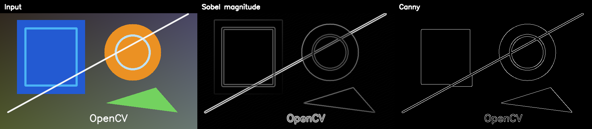

# [Edge Detection with OpenCV: Sobel and Canny in Python and C++](https://learnopencv.com/edge-detection-using-opencv/)

[](https://learnopencv.com/edge-detection-using-opencv/)

Modern, tested companion code for the LearnOpenCV tutorial. The examples validate their inputs, run headlessly by default, write reproducible Sobel and Canny outputs, and optionally open an interactive window.

[](https://github.com/spmallick/learnopencv/releases/download/edge-detection-opencv-2026.07.27/Edge-Detection-OpenCV-2026.07.27.zip)

## Python

Requires Python 3.10+ and OpenCV 4.8 through 5.x.

```bash
python3 -m pip install -r requirements.txt
python3 generate_sample_image.py
python3 edge_detection.py --low 100 --high 200
python3 -m pytest -q
```

Add `--display` when a desktop GUI is available. Run `python3 edge_detection.py --help` for all options.

## C++17

```bash
cmake -S . -B build -DCMAKE_BUILD_TYPE=Release
cmake --build build --config Release
ctest --test-dir build --output-on-failure
./build/edge_detection
```

The build requires OpenCV 4.x or 5.x with the `core`, `highgui`, `imgcodecs`, and `imgproc` modules.

## Outputs

The default run writes grayscale, Sobel X/Y, normalized gradient magnitude, Canny, and labeled comparison images to `outputs/`. The sample is deterministic; the regression tests use bounded structural checks rather than assuming every OpenCV build produces a byte-identical compressed file.

---

<p align="center">
  <a href="https://bigvision.ai/">
    
  </a>
</p>

<h2 align="center">Build Production-Ready Computer Vision &amp; AI Solutions</h2>

<p align="center">
  LearnOpenCV is maintained by <a href="https://bigvision.ai/"><strong>BigVision.AI</strong></a>, a computer vision and AI consulting company. We help organizations design, build, optimize, and deploy production-ready AI solutions. Our team has deep expertise in computer vision, deep learning, multimodal AI, and edge deployment, with experience solving complex technical challenges across industries.
</p>

<p align="center">
  Have a project in mind? Talk with our expert AI solution builders.
</p>

<p align="center">
  <a href="https://bigvision.ai/expert-ai-solution-builders?utm_source=locv-github">
    
  </a>
</p>
