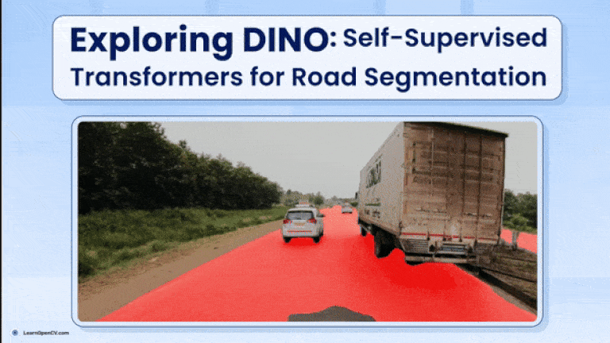

# Exploring DINO: Self-Supervised Transformers for Road Segmentation with ResNet50 and U-Net

This folder contains the Jupyter Notebooks and scripts for the LearnOpenCV article  - **[Exploring DINO: Self-Supervised Transformers for Road Segmentation with ResNet50 and U-Net](https://learnopencv.com/fine-tune-dino-self-supervised-learning-segmentation/)**.




### We have provided:
* code to prepare dataset (`data_prep.ipynb`)
* Model Training Script (`training.ipynb`)
* Video inference code (`inference.ipynb`)


### Model Download:
- Download trained model from [here](https://www.dropbox.com/scl/fi/o3p22mfd726hq0bcqin91/model_epoch_24.pth?rlkey=6jrm8cm7ge0m5vugo4fsj399o&st=j27jwke5&dl=1) and place it under `models/base_line_e50_v2/`

### Recommended File Structure:
```bash
├── data
│   ├── csv
│   ├── idd-segmentation
│   │   └── IDD_Segmentation
│   │       ├── csv
│   │       ├── gtFine
│   │       │   ├── train
│   │       │   └── val
│   │       └── leftImg8bit
│   │           ├── test
│   │           ├── train
│   │           └── val
├── public-code
│    ├── domain_adaptation
│    │   ├── source
│    │   │   └── core
│    │   │       └── csvs
│    │   └── target
│    │       ├── semi-supervised
│    │       └── weakly-supervised
│    ├── evaluation
│    ├── helpers
│    ├── preperation
│    └── viewer
├── models
│   └── base_line_e50_v2
│   └── model_epoch_24.pth
├── training.ipynb
├── data_prep.ipynb
├── inference.ipynb
├── README.md
```

You can download the trained weights and code files as well from the below link.

[](https://www.dropbox.com/scl/fo/k6lbqmkaczd7hzmf51zja/AHc58Rd4xv0bPZBtLs3JJ-Q?rlkey=e1vhsq6p8dy2i9dj8ogwxwrek&st=jecbc04c&dl=1)


## AI Courses by OpenCV

Want to become an expert in AI? [AI Courses by OpenCV](https://opencv.org/courses/) is a great place to start.

[](https://opencv.org/courses/)