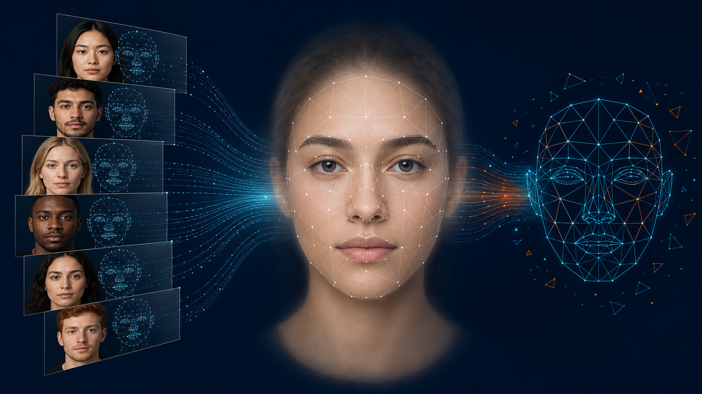

# [Average Face with OpenCV](https://learnopencv.com/average-face-opencv-c-python-tutorial/)

Companion code for [Average Face with OpenCV: C++ and Python Tutorial](https://learnopencv.com/average-face-opencv-c-python-tutorial/).

<p align="center">
  <a href="https://learnopencv.com/average-face-opencv-c-python-tutorial/">
    
  </a>
</p>

[](https://github.com/spmallick/learnopencv/releases/download/average-face-opencv-2026.07.25/average-face-opencv-2026.07.25.zip)

## What this example does

The Python and C++ programs normalize six portraits using eye-corner landmarks, compute the mean landmark geometry, build a Delaunay triangulation, warp each face triangle by triangle, and blend the normalized images into an average face.

## Requirements

- Python 3.10+ with NumPy and OpenCV 4.10+ or OpenCV 5.x
- CMake 3.16+ and a C++17 compiler for the C++ example
- A JPEG and matching `image.jpg.txt` file containing 68 landmark pairs for every input face

## Run the Python example

```bash
python -m pip install -r requirements.txt
python faceAverage.py --no-display --validate
```

The default output is `output/average-face.jpg`.

## Build and run the C++ example

```bash
cmake -S . -B build -DCMAKE_BUILD_TYPE=Release
cmake --build build --parallel
./build/face_average --input-dir presidents --no-display --validate
```

Use `--help` to see the input-directory, output-size, display, output, and validation options.

## Compatibility

The update replaces removed NumPy aliases and the retired C++ `estimateRigidTransform` call with `estimateAffinePartial2D`. It is tested with OpenCV 4.x and OpenCV 5.0 in both Python and C++.

## Files

```text
FaceAverage/
├── CMakeLists.txt
├── faceAverage.cpp
├── faceAverage.py
├── presidents/
├── requirements.txt
├── test_face_average.py
└── readme-images/
```


---

<p align="center">
  <a href="https://bigvision.ai/">
    
  </a>
</p>

<h2 align="center">Build Production-Ready Computer Vision &amp; AI Solutions</h2>

<p align="center">
  LearnOpenCV is maintained by <a href="https://bigvision.ai/"><strong>BigVision.AI</strong></a>, a computer vision and AI consulting company. We help organizations design, build, optimize, and deploy production-ready AI solutions. Our team has deep expertise in computer vision, deep learning, multimodal AI, and edge deployment, with experience solving complex technical challenges across industries.
</p>

<p align="center">
  Have a project in mind? Talk with our expert AI solution builders.
</p>

<p align="center">
  <a href="https://bigvision.ai/expert-ai-solution-builders?utm_source=locv-github">
    
  </a>
</p>
