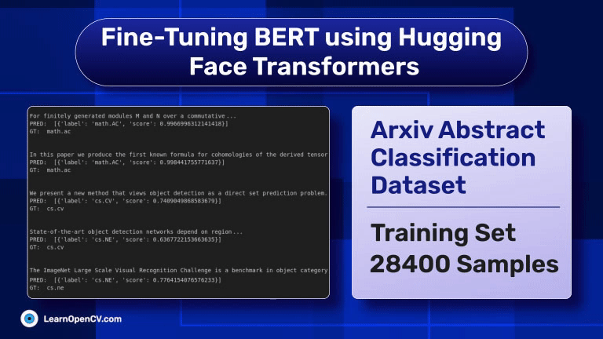

# Fine-Tuning BERT using Hugging Face Transformers

This folder contains the Jupyter Notebook for fine tuning the BERT model on the Arxiv abstract classification dataset. This is part of the LearnOpenCV blog post - [Fine Tuning TrOCR – Training TrOCR to Recognize Curved Text](https://learnopencv.com/fine-tuning-bert).

The notebook is one-click runnable and the dataset will download automatically.

## AI Courses by OpenCV

Want to become an expert in AI? [AI Courses by OpenCV](https://opencv.org/courses/) is a great place to start.

