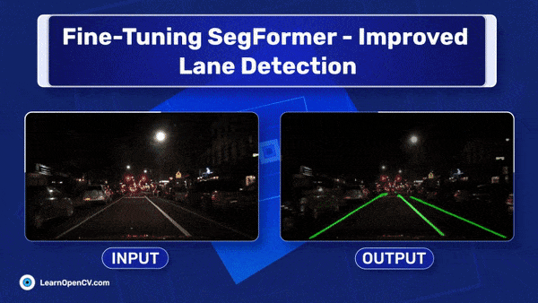

# Fine-Tuning SegFormer for Improved Lane Detection in Autonomous Vehicles

This repository contains the Jupyter Notebook for fine-tuning and inference using the SegFormer-b2 model on the Berkeley Deep Drive (BDD100K) dataset. This is part of the LearnOpenCV blog post - [SegFormer 🤗 : Fine-Tuning for Improved Lane Detection in Autonomous Vehicles](https://learnopencv.com/segformer-fine-tuning-for-lane-detection/).

The notebook is one-click runnable and the dataset will download automatically.

## AI Courses by OpenCV

Want to become an expert in AI? [AI Courses by OpenCV](https://opencv.org/courses/) is a great place to start.

