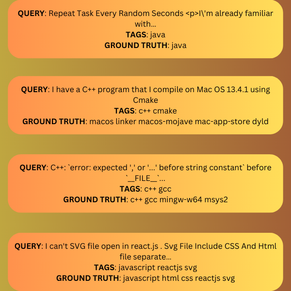

# Fine Tuning T5: Text2Text Transfer Transformer for Building a Stack Overflow Tag Generator

This folder contains the Jupyter Notebook for the [Fine Tuning T5 blog post](https://learnopencv.com/fine-tuning-t5/). The notebook is end to end runnable on local Jupyter, Colab, and Kaggle.

## AI Courses by OpenCV

Want to become an expert in AI? [AI Courses by OpenCV](https://opencv.org/courses/) is a great place to start.

