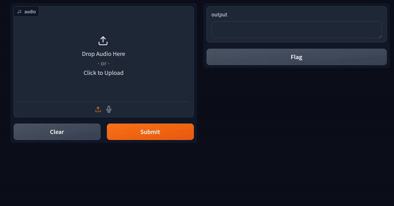

# Fine Tuning Whisper on Custom Dataset

This folder contains the Jupyter Notebooks and Scripts for the LearnOpenCV article  - **[Fine Tuning Whisper on Custom Dataset](https://learnopencv.com/fine-tuning-whisper-on-custom-dataset/)**.

We have provided notebooks for fine tuning Whisper - Tiny, Base, and Small models along with scripts for time comparison and Gradio UI.

You can download the trained weights from the below link.

## AI Courses by OpenCV

Want to become an expert in AI? [AI Courses by OpenCV](https://opencv.org/courses/) is a great place to start.

