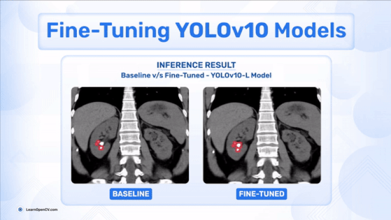

# Fine-Tuning YOLOv10 Models on Custom Dataset

**This repository contains code for [Fine-Tuning YOLOv10 Models on Custom Dataset](https://learnopencv.com/fine-tuning-yolov10/) blogpost**.

---

# AI Courses by OpenCV

Want to become an expert in AI? [AI Courses by OpenCV](https://opencv.org/courses/) is a great place to start. 

<a href="https://opencv.org/courses/">

 

</a>