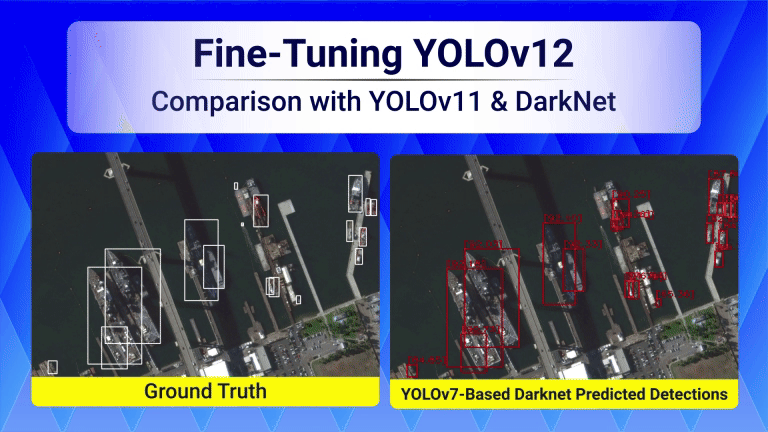

# Fine-Tuning-YOLOv12-Comparison-With-YOLOv11-And-YOLOv7-Based-Darknet

This repository contains three Jupyter notebooks, one for fine-tuning YOLOv12, one for fine-tuning YOLOv11 and the last one for YOLOv7-Based Darknet. Fine-Tuning of the models is done on HRSC2016-MS dataset.

Notebooks for fine-tuning YOLO models can be executed on Google Colab while the notebook for Darknet is advised to be executed on local machine. Some commands of the Darknet Jupyter notebook has to be executed in terminal. Proper instructions have been given in the notebooks.

It is part of the LearnOpenCV blog post - [Fine-Tuning-YOLOv12-Comparison-With-YOLOv11-And-YOLOv7-Based-Darknet](https://learnopencv.com/fine-tuning-yolov12/).

## AI Courses by OpenCV

Want to become an expert in AI? [AI Courses by OpenCV](https://opencv.org/courses/) is a great place to start.

