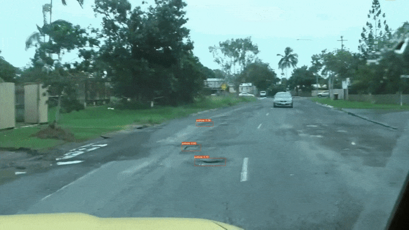

# Fine Tuning YOLOv7

This repository contains the code for the LearnOpenCV blog post **[Fine Tuning YOLOv7](https://learnopencv.com/fine-tuning-yolov7-on-custom-dataset/)**.

We train YOLOv7 and YOLOv7-Tiny models on a custom pothole detection dataset.

- The `jupyter_notebook` directory contains the Jupyter Notebook which will run end-to-end with one click. If you have Ubuntu, you can run it locally. Else, you may also upload it to Colab and run it. The notebook will train four different models for different experiments.

- The four training experiments are:
  - Fine tuning YOLOv7 with fixed resolution images.
  - Fine tuning YOLOv7 with multi-resolution images.
  - Fine tuning YOLOv7-Tiny with fixed resolution images.
  - Fine tuning YOLOv7-Tiny with multi-resolution images.

***Download the trained weights [from here](https://drive.google.com/file/d/1Bi9b-1Zucxah_aUDdqO-NjCQLHaomzFR/view?usp=sharing).***

## AI Courses by OpenCV

Want to become an expert in AI? [AI Courses by OpenCV](https://opencv.org/courses/) is a great place to start.

