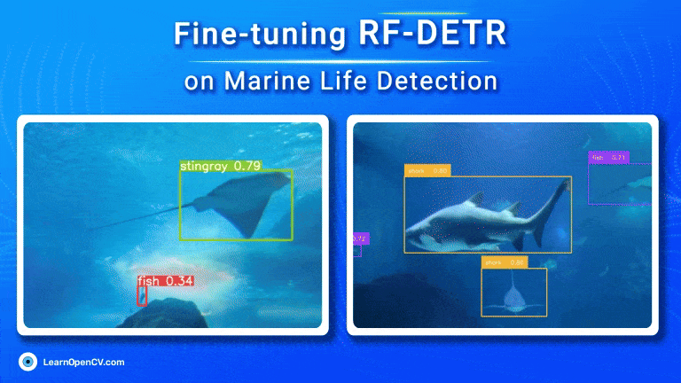

# Fine-tuning RF-DETR  

This repository contains a checkpoint directory and a scripts directory. Checkpoint directory includes checkpoints of fine-tuned RF-DETR model, fine-tuned on aquatic dataset containing a total of 7 classes. Scripts directory contains two .py files, 

1. yolo_to_coco.py: this script is used to convert YOLO format dataset into COCO format.
2. inferencing_with_RFDETR.py: this script is used to perform inferencing on RF-DETR.

This is a part of the LearnOpenCV blog post - [Fine-tuning RF-DETR](https://learnopencv.com/rf-detr-object-detection/).

- To download the finetuned model checkpoints find the link here: [Ckpt Download](https://www.dropbox.com/scl/fo/dcap29qjjri85c9yghi0r/AH7-Rcdwhy92MzoR9rJtqss?rlkey=tqpe7z0qvx4ngg4gzvr67dt1w&st=qwclgbmd&dl=1)
  

## AI Courses by OpenCV

Want to become an expert in AI? [AI Courses by OpenCV](https://opencv.org/courses/) is a great place to start.

