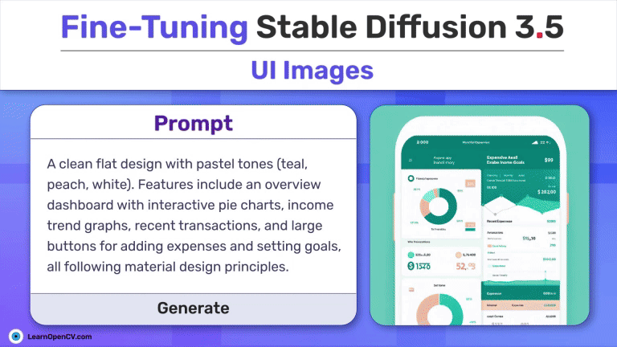

# Fine-tuning Stable Diffusion 3.5: UI images

This repository contains the Jupyter Notebook for inferencing Fine-tuned Stable Diffusion 3.5 on custom made UI dataset using the Diffusers module from Huggingface. This is part of the LearnOpenCV blog post - [Fine-tuning Stable Diffusion 3.5: UI images](https://learnopencv.com/fine-tuning-stable-diffusion-3-5m/).

To download the dataset used for LoRA fine-tuning Stable Diffusion 3.5 click on [Dataset with prompt text file](https://www.dropbox.com/scl/fi/fd1do9g1p1nxf8pvzjz9y/flat-UI-image-dataset.zip?rlkey=bsvceqmg803vdzl7kh09py9ya&st=oiflx3u6&dl=1).

You can also download the configuration file used, from this [configuration.txt](https://www.dropbox.com/scl/fi/94oq9erl2px6hy3o7ctyb/configuration_sd3_finetune_lora?rlkey=p2zbq2ecera9uan9ep9ubwrvt&st=ca5fuw83&dl=1) link.

## AI Courses by OpenCV

Want to become an expert in AI? [AI Courses by OpenCV](https://opencv.org/courses/) is a great place to start.

