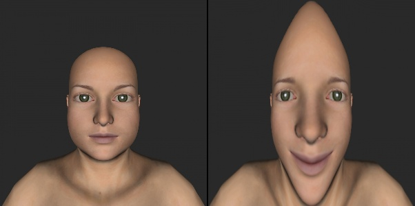
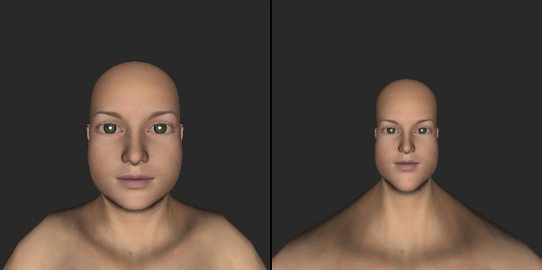

### Funny Mirrors using OpenCV

We show how to create some funny mirror effects using OpenCV. The blog is based on fundamental concepts like camera projection, intrinsic and extrinsic 
camera parameters and mesh-based image warping.

### Installing additional library
```shell
pip3 install vcam
```

### How to run the code

Command line usage for running the code

* Python

  * Running on sample images:
    	
    ```
    python3 FunnyMirrorsImages.py
    ```
    
  * Running on a video file:

    ```
    python3 FunnyMirrorsVideo.py ./data/Video3.mp4 0
    ```
    
    The syntax here is `python3 FunnyMirrorsVideo.py <VIDEO_FILE_PATH> <MODE_NUMBER>`. The `MODE_NUMBER` ranges from 0 to 7. It determines which funny mirror effect will be applied.
    

### Some funny mirrors generated




# AI Courses by OpenCV

Want to become an expert in AI? [AI Courses by OpenCV](https://opencv.org/courses/) is a great place to start. 

<a href="https://opencv.org/courses/">
<p align="center"> 

</p>
</a>

