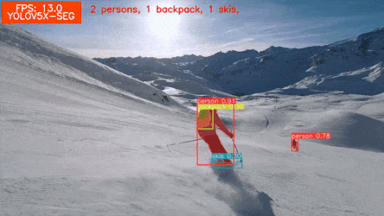

# Getting Started with YOLOv5 Instance Segmentation

This repository contains the Jupyter notebook to run inference using the YOLOv5 Instance Segmentation models for the [Getting Started with YOLOv5 Instance Segmentation](https://learnopencv.com/getting-started-with-yolov5-instance-segmentation/) article.

The `yolov5_segmentation.ipynb` contains. It can run end-to-end either, locally, on Colab, or on Kaggle.

## AI Courses by OpenCV

Want to become an expert in AI? [AI Courses by OpenCV](https://opencv.org/courses/) is a great place to start.

