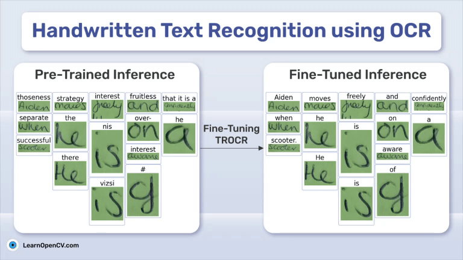

# Handwritten Text Recognition using OCR

This folder contains the Jupyter Notebooks and scripts for the LearnOpenCV article  - **[Handwritten Text Recognition using OCR](https://learnopencv.com/handwritten-text-recognition-using-ocr/)**.

We have provided:

* The scripts to preprocess the GNHK dataset
* Jupyter notebooks to run fine-tuning and inference using the TrOCR models

You can download the trained weights and code files as well from the below link.

## AI Courses by OpenCV

Want to become an expert in AI? [AI Courses by OpenCV](https://opencv.org/courses/) is a great place to start.

