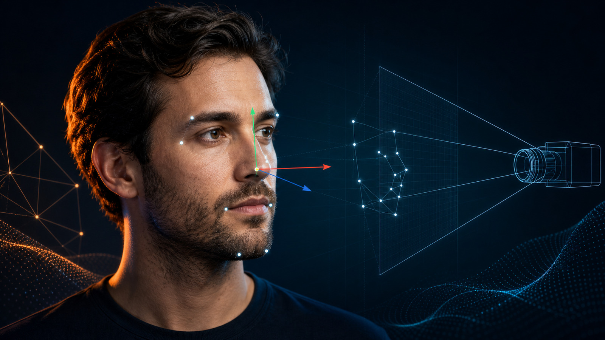

# [Head Pose Estimation with OpenCV](https://learnopencv.com/head-pose-estimation-using-opencv-and-dlib/)

Companion code for [Head Pose Estimation with OpenCV](https://learnopencv.com/head-pose-estimation-using-opencv-and-dlib/).

<p align="center">
  <a href="https://learnopencv.com/head-pose-estimation-using-opencv-and-dlib/">
    
  </a>
</p>

[](https://github.com/spmallick/learnopencv/releases/download/head-pose-opencv-2026.07.25/head-pose-opencv-2026.07.25.zip)

## What this example does

The Python and C++ programs estimate a six-point 3D head pose with `solvePnP`, project a direction line from the nose, save the annotated result, and report reprojection error. The bundled image uses fixed landmark coordinates so the example stays focused on pose estimation; use a face-landmark detector when adapting it to new images.

## Requirements

- Python 3.10+ with NumPy and OpenCV 4.10+ or OpenCV 5.x
- CMake 3.16+ and a C++17 compiler for the C++ example

## Run the Python example

```bash
python -m pip install -r requirements.txt
python headPose.py --no-display --validate
```

Outputs are written to `output/head-pose-result.jpg` and `output/head-pose-metrics.json`.

## Build and run the C++ example

```bash
cmake -S . -B build -DCMAKE_BUILD_TYPE=Release
cmake --build build --parallel
./build/head_pose --input headPose.jpg --no-display --validate
```

Use `--help` to see the input, output, focal-length, display, and validation options.

## Compatibility

The example is tested with OpenCV 4.x and OpenCV 5.0. It uses C++17, Python 3, explicit input checks, reproducible saved outputs, and a headless validation mode suitable for CI.

## Files

```text
HeadPose/
├── CMakeLists.txt
├── headPose.cpp
├── headPose.py
├── headPose.jpg
├── requirements.txt
├── test_head_pose.py
└── readme-images/
```

---

<p align="center">
  <a href="https://bigvision.ai/">
    
  </a>
</p>

<h2 align="center">Build Production-Ready Computer Vision &amp; AI Solutions</h2>

<p align="center">
  LearnOpenCV is maintained by <a href="https://bigvision.ai/"><strong>BigVision.AI</strong></a>, a computer vision and AI consulting company. We help organizations design, build, optimize, and deploy production-ready AI solutions. Our team has deep expertise in computer vision, deep learning, multimodal AI, and edge deployment, with experience solving complex technical challenges across industries.
</p>

<p align="center">
  Have a project in mind? Talk with our expert AI solution builders.
</p>

<p align="center">
  <a href="https://bigvision.ai/expert-ai-solution-builders?utm_source=locv-github">
    
  </a>
</p>
