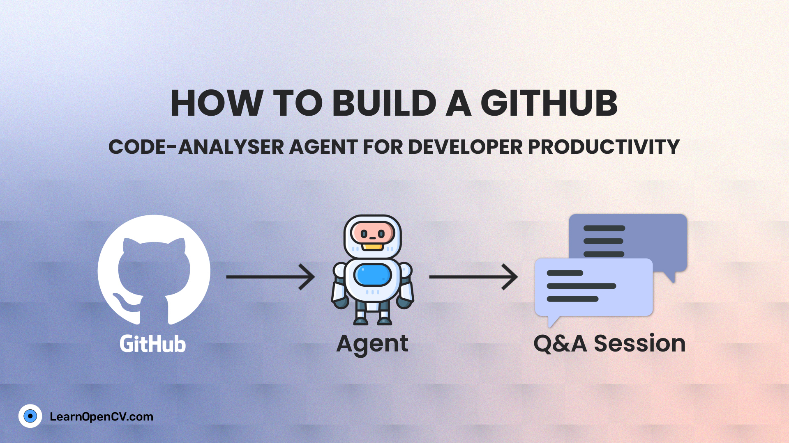

# How to Build a GitHub Code-Analyser Agent for Developer Productivity

Understanding large GitHub repositories can be time-consuming and frustrating, especially when you don’t know where to start. **Code-Analyser** tackles this prBoblem by using an agentic, state-driven approach to parse and analyze codebases incrementally. Built on **LangGraph** and powered by **Gemini**, the system selects only relevant files based on user intent, caches parsed results, and maintains conversational context across queries. Instead of scanning everything upfront, Code-Analyser grows smarter with each question making repository exploration faster, cheaper, and more intuitive.

It is part of the LearnOpenCV blog post - [How to Build a GitHub Code-Analyser Agent for Developer Productivity](https://learnopencv.com/how-to-build-a-github-code-analyser-agent/)

## AI Courses by OpenCV

Want to become an expert in AI? [AI Courses by OpenCV](https://opencv.org/courses/) is a great place to start.

