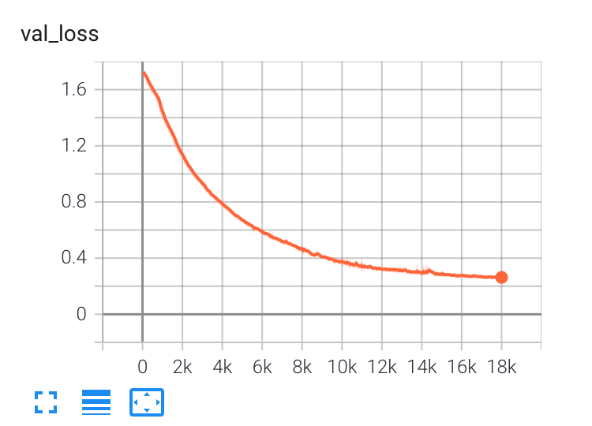
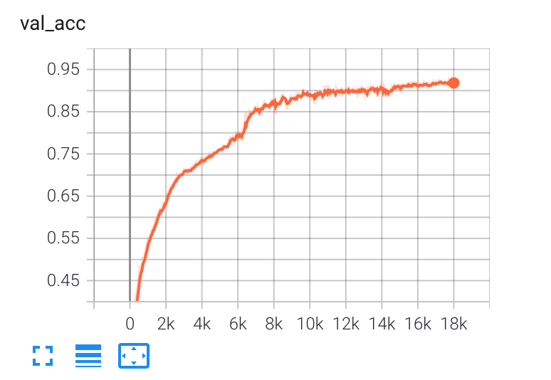

# Human Action Recognition using Detectron2 and LSTM

**This repository contains code for [Human Action Recognition using Detectron2 and LSTM](https://learnopencv.com/human-action-recognition-using-detectron2-and-lstm/) blogpost**.

This is an application built to show how human action classification can be done using 2D Pose Estimation and LSTM RNN machine learning models. 

2D pose estimation is done using Facebook AI Research's Detectron2. A LSTM model is used to classify actions from 2D pose estimation output from a sequence of consecutive frames on a video. 

We also provide the colab notebook: 
 

## LSTM training

We have trained our own LSTM model from data set given under https://github.com/stuarteiffert/RNN-for-Human-Activity-Recognition-using-2D-Pose-Input.

Since we are using Detectron2 for pose estimation, we have retrofitted the dataset to map to Detectron2 output format for training our LSTM model. (Original dataset is created using [OpenPose](https://github.com/CMU-Perceptual-Computing-Lab/openpose) library which output 18 keypoints (or more) per human from the input image while Detectron2 produces only 17 keypoints).

Model classifies the action into 6 categories
- JUMPING
- JUMPING_JACKS
- BOXING
- WAVING_2HANDS
- WAVING_1HAND
- CLAPPING_HANDS

Speciality about this app is that we are using pytorch libraries for both Pose Detection and LSTM. Detectron2 is written using pytorch. Our LSTM model is built using pytorch and is trained using pytorch-lightining. pytorch-lightning makes the training code very easy and concise.

We have trained our LSTM model and have saved the best model at *models/saved_model.ckpt*, same is used in the application for inferencing when you run the application. 

<table><tr><td>
Validation Loss  

</td>
<td>
Validation Accuracy  

</td></tr></table>

## Running the application

You need a machine with GPU to run our application. So, the easy way to run the application is to run it on google colab. Use the google colab notebook provided below to run the application. 
Open a browser with the application url you got while running the notebook.

You will see two options to do action classification
1. You can upload your own input video and click on 'Submit' botton to see the action classification results. If you are uploading your own video, make sure that video has a single person in it and is performing one of 6 the actions mentioned above. Also make sure that to upload a small video snippet, otherwise it might be very slow to process.
2. You can use the sample video you see on the page and click on 'Submit' button to see the results. Thanks to my son, who was kind enough to perform few actions and allowing me to record him :).

When you click on 'Submit', you will see a progress bar showing the progress and once done, you can download the output from the 'Download Result File' link. If you have submitted using the sample video given on the page, you can see that our model was able to classify the actions decently well. Actions infered from the video are shown on the out put video.

## Jupyter notebooks

We have provided jupytyer notebooks to run the application 
1. To run the application (for example in google colab),  use *human_action_classification.ipynb*
2. To train the LSTM model, use *lstm_train.ipynb* (You don't need this unless you want to retrain the model with your own data set or experiment with it.)
