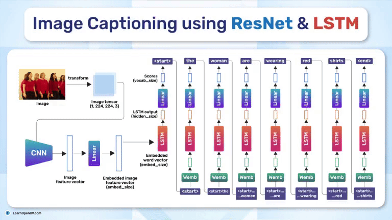

# Image Captioning using ResNet and LSTM

This repository contains the Notebook file to Train the Model and Python script to run the Inference.   

It is part of the LearnOpenCV blog post - [Image Captioning using ResNet and LSTM](https://learnopencv.com/image-captioning/)

### Run Inference

Install the `requirements.txt`file in your python environment.

Run the `train.py` file to train the model.

Run the ``app.py`` file to run the inference.

## AI Courses by OpenCV

Want to become an expert in AI? [AI Courses by OpenCV](https://opencv.org/courses/) is a great place to start.

