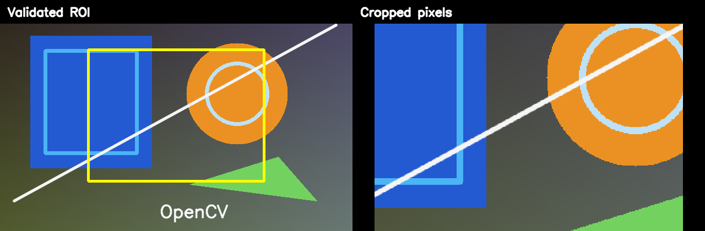

# [Cropping Images with OpenCV: Safe ROIs and Patches](https://learnopencv.com/cropping-an-image-using-opencv/)

[](https://learnopencv.com/cropping-an-image-using-opencv/)

Modern Python and C++17 companion code for selecting a region of interest, copying cropped pixels safely, and splitting an image into patches without silently losing partial edge tiles.

[](https://github.com/spmallick/learnopencv/releases/download/image-cropping-opencv-2026.07.27/Image-Cropping-OpenCV-2026.07.27.zip)

## Python

Requires Python 3.10+ and OpenCV 4.8 through 5.x.

```bash
python3 -m pip install -r requirements.txt
python3 crop_image.py --roi 160 90 320 240 --tile-size 160 140
python3 -m pytest -q
```

The default run is headless. Add `--display` when a desktop GUI is available.

## C++17

```bash
cmake -S . -B build -DCMAKE_BUILD_TYPE=Release
cmake --build build --config Release
ctest --test-dir build --output-on-failure
./build/crop_image --roi 160 90 320 240 --tile-size 160 140
```

OpenCV 4.x or 5.x is supported with `core`, `highgui`, `imgcodecs`, and `imgproc`.

## Output and coordinate convention

Both implementations use `(x, y, width, height)`. Array indexing is row first, so the Python crop is `image[y:y+height, x:x+width]`; C++ uses `cv::Rect(x, y, width, height)`. The programs validate the entire ROI before slicing and copy/clone the result so later edits do not mutate the source unexpectedly.

The sample run writes a crop comparison, cropped image, contact sheet, and 12 individual patch files.

---

<p align="center">
  <a href="https://bigvision.ai/">
    
  </a>
</p>

<h2 align="center">Build Production-Ready Computer Vision &amp; AI Solutions</h2>

<p align="center">
  LearnOpenCV is maintained by <a href="https://bigvision.ai/"><strong>BigVision.AI</strong></a>, a computer vision and AI consulting company. We help organizations design, build, optimize, and deploy production-ready AI solutions. Our team has deep expertise in computer vision, deep learning, multimodal AI, and edge deployment, with experience solving complex technical challenges across industries.
</p>

<p align="center">
  Have a project in mind? Talk with our expert AI solution builders.
</p>

<p align="center">
  <a href="https://bigvision.ai/expert-ai-solution-builders?utm_source=locv-github">
    
  </a>
</p>
