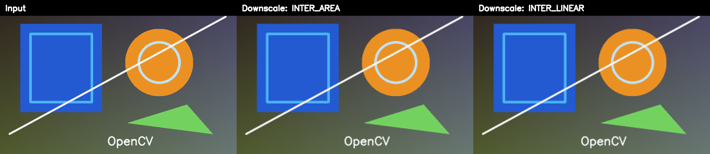

# [Image Resizing with OpenCV: Scale, Interpolation, and Letterboxing](https://learnopencv.com/image-resizing-with-opencv/)

[](https://learnopencv.com/image-resizing-with-opencv/)

Modern Python and C++17 companion examples for exact dimensions, scale factors, aspect-ratio-preserving resize, interpolation selection, and letterboxing.

[](https://github.com/spmallick/learnopencv/releases/download/image-resizing-opencv-2026.07.27/Image-Resizing-OpenCV-2026.07.27.zip)

## Python

Requires Python 3.10+ and OpenCV 4.8 through 5.x.

```bash
python3 -m pip install -r requirements.txt
python3 resize_image.py
python3 -m pytest -q
```

The run is headless by default. Add `--display` when a desktop GUI is available.

## C++17

```bash
cmake -S . -B build -DCMAKE_BUILD_TYPE=Release
cmake --build build --config Release
ctest --test-dir build --output-on-failure
./build/resize_image
```

The CMake build supports OpenCV 4.x and 5.x with `core`, `highgui`, `imgcodecs`, and `imgproc`.

## Choosing interpolation

- Use `INTER_AREA` as the strong default for shrinking.
- Use `INTER_LINEAR` for fast general-purpose enlargement.
- Use `INTER_CUBIC` when a slower, smoother enlargement is worthwhile.
- Use `INTER_NEAREST` for discrete label masks when class IDs must not be blended.

The sample writes downscaled and upscaled images, a `640×640` letterboxed result, and a labeled interpolation comparison. Tests validate geometry and padding, not compressed-file bytes.

---

<p align="center">
  <a href="https://bigvision.ai/">
    
  </a>
</p>

<h2 align="center">Build Production-Ready Computer Vision &amp; AI Solutions</h2>

<p align="center">
  LearnOpenCV is maintained by <a href="https://bigvision.ai/"><strong>BigVision.AI</strong></a>, a computer vision and AI consulting company. We help organizations design, build, optimize, and deploy production-ready AI solutions. Our team has deep expertise in computer vision, deep learning, multimodal AI, and edge deployment, with experience solving complex technical challenges across industries.
</p>

<p align="center">
  Have a project in mind? Talk with our expert AI solution builders.
</p>

<p align="center">
  <a href="https://bigvision.ai/expert-ai-solution-builders?utm_source=locv-github">
    
  </a>
</p>
