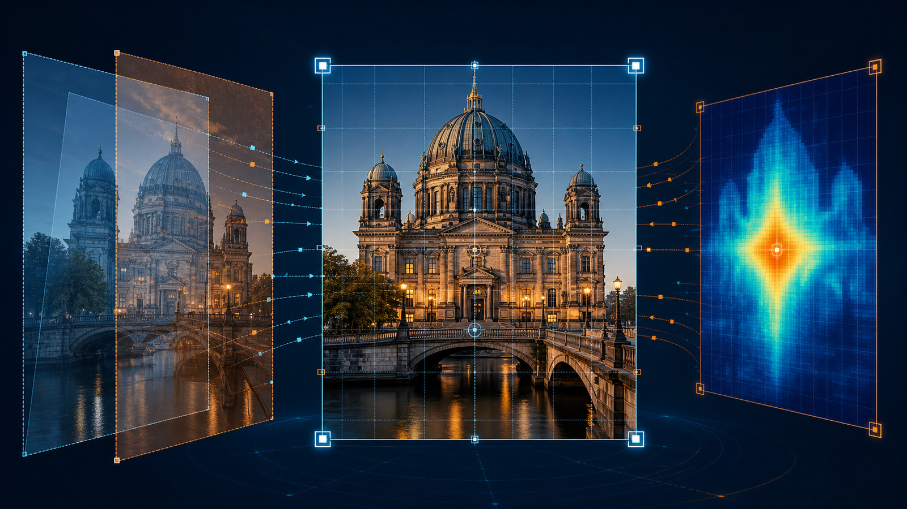

# [Image Alignment with ECC in OpenCV](https://learnopencv.com/image-alignment-ecc-in-opencv-c-python/)

Companion code for [Image Alignment with ECC in OpenCV: C++ and Python](https://learnopencv.com/image-alignment-ecc-in-opencv-c-python/).

<p align="center">
  <a href="https://learnopencv.com/image-alignment-ecc-in-opencv-c-python/">
    
  </a>
</p>

[](https://github.com/spmallick/learnopencv/releases/download/image-alignment-ecc-opencv-2026.07.25/image-alignment-ecc-opencv-2026.07.25.zip)

## What these examples do

- `image_alignment_simple_example.py/.cpp` aligns a moving image to a template and reports the ECC correlation, warp matrix, and before/after error.
- `image_alignment.py/.cpp` reconstructs a color image from vertically stacked monochrome plates by aligning the blue and green channels to red.

Both paths support translation, Euclidean, affine, and homography motion models.

## Requirements

- Python 3.10+ with NumPy and OpenCV 4.10+ or OpenCV 5.x
- CMake 3.16+ and a C++17 compiler for the C++ examples

## Run the Python examples

```bash
python -m pip install -r requirements.txt
python image_alignment_simple_example.py --no-display --validate
python image_alignment.py --no-display --validate
```

Outputs are written to `output/`.

## Build and run the C++ examples

```bash
cmake -S . -B build -DCMAKE_BUILD_TYPE=Release
cmake --build build --parallel
./build/image_alignment_simple --no-display --validate
./build/image_alignment --no-display --validate
```

Use `--help` to see the input, motion-model, convergence, output, display, and validation options.

## Compatibility

The update removes Python 2 syntax, fixes the missing C++ sample-image path, initializes each channel warp independently, and adds robust size handling plus saved outputs. Both Python and C++ paths are tested with OpenCV 4.x and OpenCV 5.0.

## Files

```text
ImageAlignment/
├── CMakeLists.txt
├── ecc_utils.py
├── image_alignment.cpp
├── image_alignment.py
├── image_alignment_simple_example.cpp
├── image_alignment_simple_example.py
├── images/
├── requirements.txt
├── test_ecc.py
└── readme-images/
```

---

<p align="center">
  <a href="https://bigvision.ai/">
    
  </a>
</p>

<h2 align="center">Build Production-Ready Computer Vision &amp; AI Solutions</h2>

<p align="center">
  LearnOpenCV is maintained by <a href="https://bigvision.ai/"><strong>BigVision.AI</strong></a>, a computer vision and AI consulting company. We help organizations design, build, optimize, and deploy production-ready AI solutions. Our team has deep expertise in computer vision, deep learning, multimodal AI, and edge deployment, with experience solving complex technical challenges across industries.
</p>

<p align="center">
  Have a project in mind? Talk with our expert AI solution builders.
</p>

<p align="center">
  <a href="https://bigvision.ai/expert-ai-solution-builders?utm_source=locv-github">
    
  </a>
</p>
