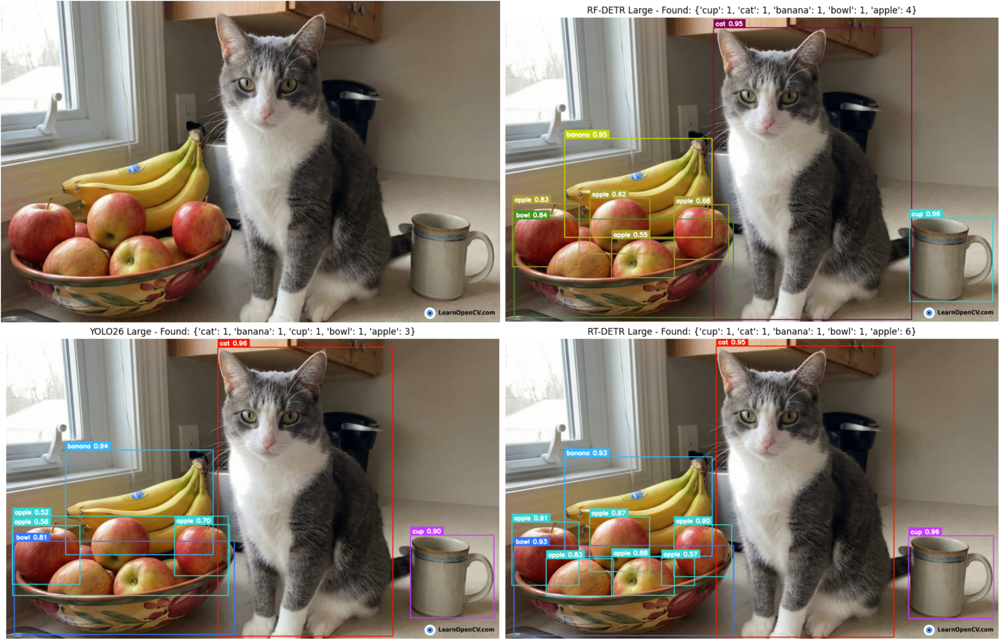

# The Great Real-Time Showdown: RF-DETR vs. YOLO26 vs. RT-DETR

## 📌 Overview
This repository contains the benchmarking suite to evaluate and compare three state-of-the-art (SOTA) real-time object detection models:
* **RF-DETR (Medium)**
* **YOLO26 (Large)**
* **RT-DETR (Extra Large)**

Qualitative comparison of RF-DETR, YOLO26, and RT-DETR (Large).

The included notebook tests **Latency (ms)** and **Throughput (img/s)** across different batch sizes and precision modes (FP32 vs. FP16). It is designed to help computer vision engineers navigate the CNN vs. Transformer divide and choose the right architecture for deployment on constrained edge hardware.

## 📂 Repository Contents
* `Inference_(RT_DETR,_YOLO26,_RF_DETR).ipynb`: The complete benchmarking harness. This script downloads the pre-trained weights, runs the latency/throughput loops, generates Seaborn performance charts, and outputs a visual sanity check.
* `crowd.png`: A highly complex, dense urban street scene used to stress-test the models' post-processing efficiency and throughput.
* `human.png`: A standard pedestrian view for qualitative validation.
* `cat.png`: A close-up subject for baseline qualitative validation.

## 🚀 How to Run
The easiest way to execute this benchmark is using Google Colab or a local Jupyter environment.

1. Open `Inference_(RT_DETR,_YOLO26,_RF_DETR).ipynb`.
2. Run the cells sequentially to install dependencies (`ultralytics`, `rfdetr`), execute the benchmarks, and plot the results.

## 📊 Key Findings
* **The Speed Champion:** YOLO26 (Large) at FP16 with a Batch Size of 1 offers the lowest median latency for strict real-time applications.
* **FP16 is the Standard:** Switching to half-precision provides a massive speedup across all modern hardware tiers with virtually zero degradation in bounding box accuracy.
* **Transformer Viability:** RT-DETR and RF-DETR deliver highly competitive throughput, proving that Transformer-based architectures are entirely viable for high-speed, real-world deployment without the need for NMS tuning.

---
*For a complete architectural deep-dive and analysis of these results, check out the full article on [LearnOpenCV.com](https://learnopencv.com).*
