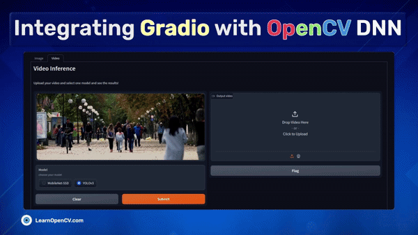

# Integrating Gradio with OpenCV DNN

This repository contains the Notebook file and Python scripts to run the Inference.   

It is part of the LearnOpenCV blog post - [Integrating Gradio with OpenCV DNN]([https://learnopencv.com/integrating-gradio-with-opencv-dnn/(opens in a new tab)](https://learnopencv.com/?p=54403)).

### Run Inference

Run the ``app.py`` file in your python environment.

## AI Courses by OpenCV

Want to become an expert in AI? [AI Courses by OpenCV](https://opencv.org/courses/) is a great place to start.

