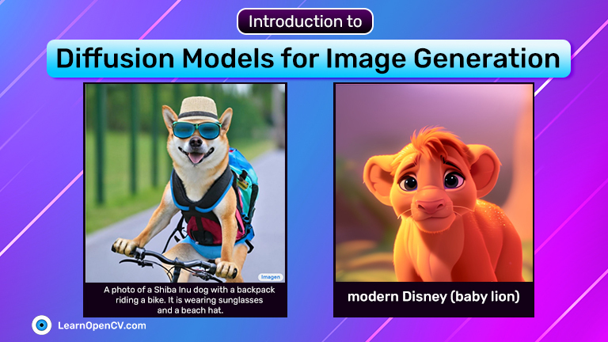

# README

This repository contains the notebooks to run Stable Diffusion 1.4 on 6 GB VRAM GPU and CPU. These two notebooks are part of the blog post - [Introduction to Diffusion Models for Image Generation](https://learnopencv.com/image-generation-using-diffusion-models/).

 

The notebooks can be executed end-to-end without any other dependencies.

## AI Courses by OpenCV

Want to become an expert in AI? [AI Courses by OpenCV](https://opencv.org/courses/) is a great place to start.

