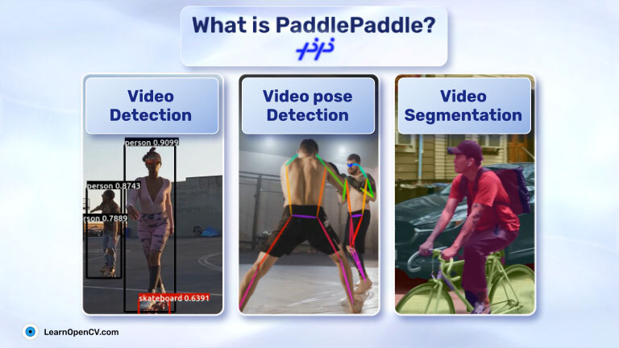

# Getting Started with PaddlePaddle: Exploring Object Detection, Segmentation, and Keypoints

This repository contains notebook for [Getting Started with PaddlePaddle: Exploring Object Detection, Segmentation, and Keypoints](https://learnopencv.com/?p=49857) blogpost

There are two notebooks in this folder:

- `Paddle_Detection_PoseEstimation.ipynb`: Uses DINO for object detection and HRNet for Pose Estimation  

- `PaddleSeg.ipynb`:  Uses HRNet for Semantic Segmentation

Addionally, there is a folder called `test_images`. It contains few example input images that have been used for experimentation.

                                                                                                                                                                                                                          

# AI Courses by OpenCV                                                                                                                                                        

Want to become an expert in AI? [AI Courses by OpenCV](https://opencv.org/courses/) is a great place to start. 

<a href="https://opencv.org/courses/">

 

</a>o
