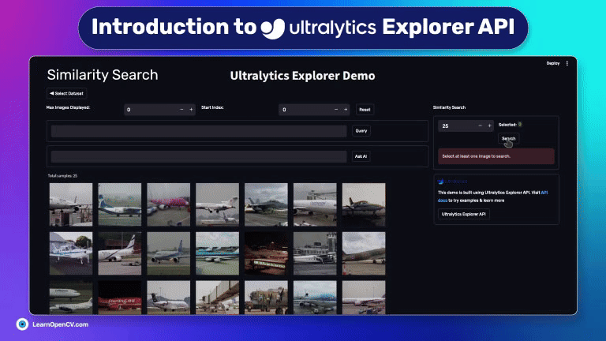

# Introduction to Ultralytics Explorer API

[Ankan Ghosh](https://learnopencv.com/author/ankan/)

This repository contains the Python Notebooks to run the Inference.   

It is part of the LearnOpenCV blog post - [Introduction to Ultralytics Explorer API](https://learnopencv.com/ultralytics-explorer-api/).

### Run Inference

Run the ``explorer.ipynb`` file in your python environment.

## AI Courses by OpenCV

Want to become an expert in AI? [AI Courses by OpenCV](https://opencv.org/courses/) is a great place to start.

